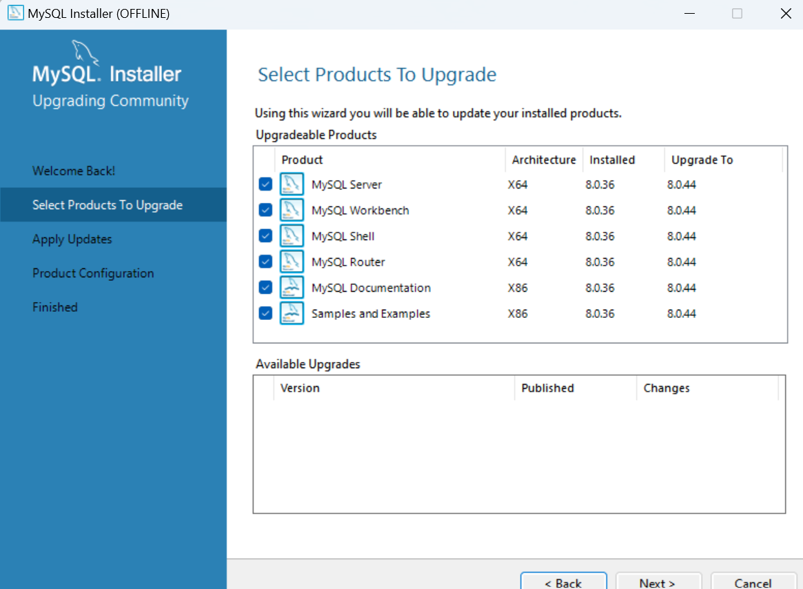

# Node.js 和 MySQL 安装指南

本指南将帮助您在 Windows 系统上安装和配置 Node.js 和 MySQL，以便运行在线购物网站项目。

## 1. 安装 Node.js

### 步骤 1：下载 Node.js 安装包
1. 访问 Node.js 官方网站：[https://nodejs.org/zh-cn/](https://nodejs.org/zh-cn/)
2. 下载推荐的长期支持版本（LTS），这是最稳定的版本，适合生产环境使用

### 步骤 2：运行安装程序
1. 双击下载的 `.msi` 安装包
2. 点击 "Next" 继续
3. 勾选 "I accept the terms in the License Agreement" 并点击 "Next"
4. 选择安装位置（建议使用默认路径），然后点击 "Next"
5. 在 "Custom Setup" 页面，保持默认选项，点击 "Next"
6. 点击 "Install" 开始安装
7. 安装完成后，点击 "Finish"

### 步骤 3：验证安装
1. 打开命令提示符（CMD）或 PowerShell
2. 运行以下命令检查 Node.js 版本：
   ```bash
   node -v
   ```
3. 运行以下命令检查 npm 版本（npm 是 Node.js 的包管理器，会随 Node.js 一起安装）：
   ```bash
   npm -v
   ```

如果命令执行成功并显示版本号，则说明 Node.js 和 npm 安装成功。

## 2. 安装 MySQL

### 步骤 1：下载 MySQL Installer
1. 访问 MySQL 官方网站：[https://dev.mysql.com/downloads/installer/](https://dev.mysql.com/downloads/installer/)
2. 下载 "MySQL Installer for Windows"（选择 32 位或 64 位版本，根据您的 Windows 系统选择）

### 步骤 2：运行 MySQL Installer
1. 双击下载的安装包
2. 在 "Choosing a Setup Type" 页面，选择 "Developer Default"（开发人员默认），然后点击 "Next"
3. 在 "Check Requirements" 页面，点击 "Execute" 安装必要的依赖项，然后点击 "Next"
4. 在 "Installation" 页面，点击 "Execute" 开始安装 MySQL 组件，安装完成后点击 "Next"

### 步骤 3：配置 MySQL
1. 在 "Product Configuration" 页面，点击 "Next"
2. **Type and Networking**：
   - 保持默认的 "Development Computer" 选项
   - 端口号保持默认的 3306
   - 点击 "Next"
3. **Authentication Method**：
   - 选择 "Use Strong Password Encryption for Authentication"
   - 点击 "Next"
4. **Accounts and Roles**：
   - 设置 root 用户密码（请牢记此密码）
   - 可以选择添加其他用户（可选）
   - 点击 "Next"
5. **Windows Service**：
   - 保持默认选项，将 MySQL 配置为 Windows 服务
   - 服务名称保持默认的 "MySQL80"
   - 点击 "Next"
6. **Apply Configuration**：
   - 点击 "Execute" 应用所有配置
   - 配置完成后点击 "Finish"
7. 点击 "Next"，然后点击 "Finish" 完成安装

### 步骤 4：验证 MySQL 安装
1. 打开命令提示符（CMD）
2. 运行以下命令连接到 MySQL 服务器（使用您设置的 root 密码）：
   ```bash
   mysql -u root -p
   ```
3. 输入密码后，如果看到 MySQL 命令行提示符 `mysql>`，则说明 MySQL 安装成功

### 步骤 5：创建数据库
1. 在 MySQL 命令行中，运行以下命令创建项目所需的数据库：
   ```sql
   CREATE DATABASE shopping_db;
   ```
2. 运行以下命令查看数据库是否创建成功：
   ```sql
   SHOW DATABASES;
   ```
   您应该能看到 `shopping_db` 数据库在列表中

## 3. 配置项目

### 步骤 1：安装项目依赖
1. 打开命令提示符，导航到项目根目录：
   ```bash
   cd d:\trae\shopping web
   ```
2. 运行以下命令安装后端依赖：
   ```bash
   npm install
   ```

### 步骤 2：配置环境变量
1. 复制 `.env.example` 文件并重命名为 `.env`：
   ```bash
   copy .env.example .env
   ```
2. 使用文本编辑器打开 `.env` 文件，配置数据库连接信息：
   ```
   # 数据库配置
   DB_HOST=localhost
   DB_PORT=3306
   DB_USER=root
   DB_PASSWORD=您设置的MySQL密码
   DB_NAME=shopping_db
   ```

### 步骤 3：启动项目
1. 运行以下命令启动后端服务器：
   ```bash
   npm start
   ```

## 4. 常见问题解决

### Node.js 安装问题
- 如果安装后无法使用 `npm` 命令，请检查环境变量是否正确配置
- 尝试重新启动计算机后再次验证

### MySQL 安装问题
- 如果忘记了 root 密码，可以参考 MySQL 官方文档重置密码
- 如果无法连接到 MySQL 服务器，请检查 MySQL 服务是否正在运行（在 "服务" 中查看）

## 5. 更多资源

- [Node.js 官方文档](https://nodejs.org/zh-cn/docs/)
- [MySQL 官方文档](https://dev.mysql.com/doc/)
- [Sequelize ORM 文档](https://sequelize.org/master/)

如果您在安装过程中遇到任何问题，请随时搜索相关错误信息或查阅官方文档。